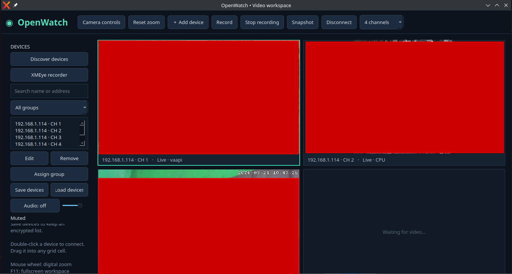
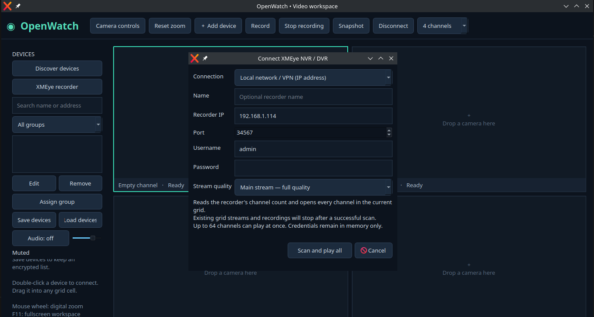
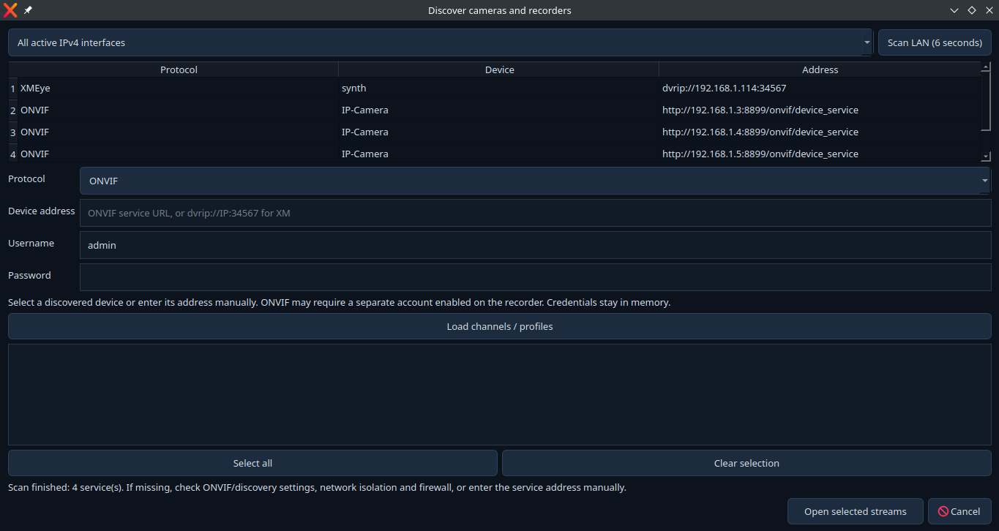
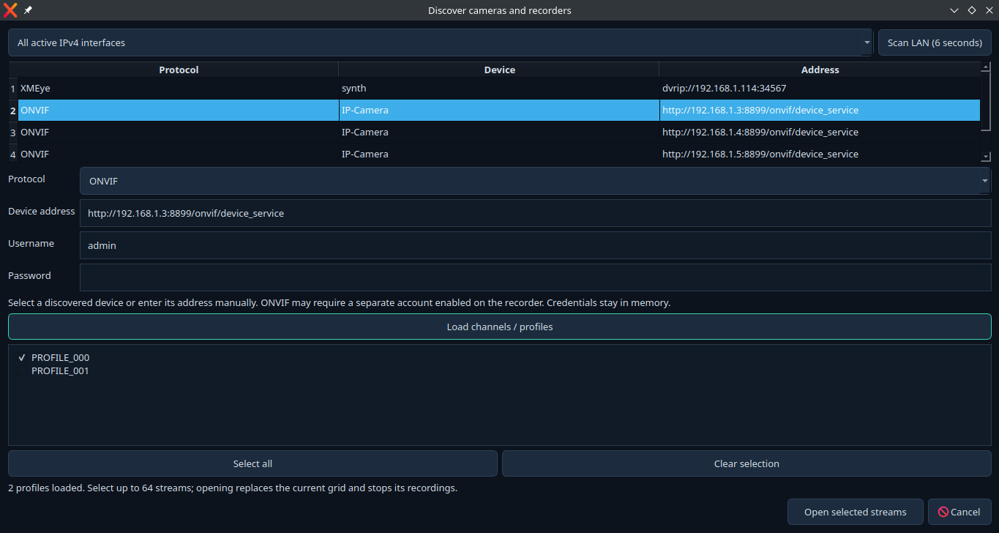
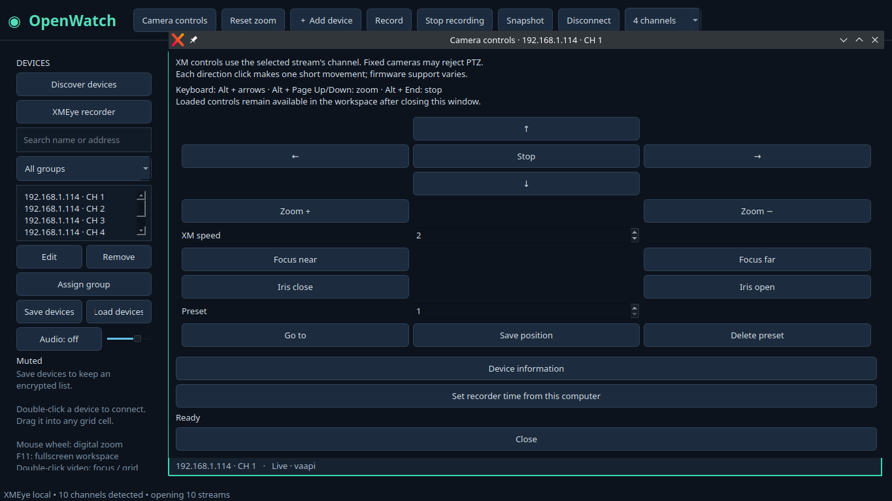
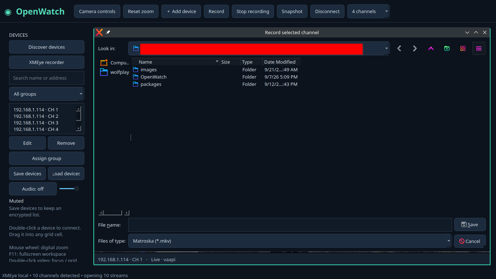

# OpenWatch VMS

**A free, open-source, experimental desktop Video Management System for Xiongmai/XM recorders and IP cameras.** Built with C++17, Qt 6 and FFmpeg, with a native dark interface and no ActiveX/browser-plugin dependency.

**Current application version: 0.11.3.** Linux builds are available in this project's deliverables. Windows x64 is a source-build target; its build/runtime has not been verified in the development environment. This is an independent project, not an official XMEye/Xiongmai product.

> **AI code authorship:** The original OpenWatch application code, tests, build scripts and documentation were generated and revised by **OpenAI Codex**, an AI coding assistant, under the project owner's direction. The owner supplied requirements, screenshots and real-device testing feedback. Third-party libraries and the referenced protocol research were written by their respective authors, not by Codex. AI-generated code and passing simulated tests do not guarantee compatibility with every recorder.

> **Important limitations:** XMEye P2P/cloud/serial-number connections are **not implemented**. NVR recording playback was attempted but **removed from the application** because it remained unreliable. Use the phone app or the recorder itself for archive playback. See [known limitations](#known-limitations) before choosing this software.



*User-provided screenshot from `images/`. The red regions were already present in the supplied image and conceal camera views; they are not a rendering effect produced by OpenWatch. Screenshots may show an earlier interface revision.*

## Features and status

| Area | Available now | Boundaries |
| --- | --- | --- |
| XM / Sofia / DVRIP | IP login, channel enumeration, main/substream live viewing, keepalive and reconnect | Local/routed IP access; firmware quirks remain possible |
| ONVIF | IPv4 WS-Discovery, Media/Media2 profiles, RTSP URI retrieval and experimental PTZ | Partial implementation; no Profile S/T certification |
| Generic streams | RTSP over TCP; FFmpeg paths for RTMP and HTTP(S) HLS | RTSP has received the most testing; other formats are not broadly field-tested |
| Live workspace | 1/4/9/16/25/36/64 cells, drag-and-drop, channel focus, fullscreen and pointer-centered digital zoom | 64 cells is a layout option, not a 64-camera performance guarantee |
| Video | H.264/H.265 through FFmpeg; hardware-device initialization with CPU fallback | VAAPI, DXVA2/D3D11VA, CUDA/NVDEC and QSV depend on drivers/build; rendering still copies frames into system memory |
| Audio | Selected RTSP camera/NVR channel to default speakers, mute and volume | Starts muted; no direct DVRIP audio, microphone or two-way talk |
| Camera controls | XM and ONVIF pan/tilt/zoom and presets; XM focus/iris and device information | Device-dependent; no PTZ tours; ONVIF focus/iris not implemented |
| Devices | Add/edit/remove, search, groups, encrypted device-list save/load | Explicit saves; no automatic restore or role-based accounts |
| Local capture | PNG snapshots; manual video-only MKV recording | No audio recording, scheduled recording, retention or event-triggered recording |
| Resilience | Live reconnect with 1–30 second backoff | Recording resumes into a new segment rather than appending to the interrupted file |

Protocol and interoperability references are collected in [Sources and acknowledgements](docs/sources.md), with implementation details in [protocol notes](docs/protocol.md).

## Connect and watch

### XMEye NVR/DVR over LAN or VPN

1. Click **XMEye recorder**.
2. Enter the recorder's IP, DVRIP TCP port (usually `34567`), username and password.
3. Select substream for lower bandwidth, or main stream for full quality.
4. Click **Scan and play all**. OpenWatch reads the reported channel capacity and opens up to 64 channels.

A successful scan replaces the current grid streams and stops their recordings. Offline or unconfigured channels can still be listed because channel capacity is not the same as the number of connected cameras. For another location, establish routing through your VPN first; OpenWatch does not configure the VPN or contact XMEye cloud servers.



### Discover an ONVIF camera

1. Click **Discover devices → Scan LAN**. Choose a network interface if necessary.
2. Select the camera, enter its credentials and click **Load channels / profiles**.
3. Select the profiles and click **Open selected streams**.





Discovery uses XM UDP broadcast and ONVIF WS-Discovery. It cannot discover every RTSP-only camera, and broadcast/multicast discovery may not cross a routed VPN. Enter the service URL or stream manually when needed. The ONVIF service may use a different port from RTSP; use the camera's actual ONVIF address, not an assumed port 80. There is no mDNS or IPv6 discovery.

### Camera controls and shortcuts

Select the live cell and open **Camera controls**. For ONVIF, load the service's profiles and select the intended profile. Loaded controls remain available after closing the dialog for that session. Some incomplete ONVIF implementations need the explicit **Compatibility mode**.



| Action | Control |
| --- | --- |
| Focus one video / return to grid | Double-click video |
| Previous / next channel | Left / Right |
| Digital zoom | Mouse wheel at pointer; **Reset zoom** restores fit |
| Workspace fullscreen | F11; Esc restores the view |
| Physical pan/tilt | Alt + arrow keys |
| Optical zoom | Alt + Page Up / Page Down |
| PTZ stop | Alt + End |

PTZ keys target the selected channel and require its controls to be loaded. Movement uses short pulses, not indefinitely held movement. Fixed cameras and unsupported firmware can reject commands. **Set recorder time** changes the whole XM recorder's clock; it is an explicit user action.

### Snapshots, recording and audio

**Record** saves the selected stream as a video-only `.mkv`, starting at the next keyframe. **Stop recording** finalizes it. **Snapshot** saves a PNG. Play saved MKVs with an external player that supports the stream's codec; OpenWatch currently has no local-file playback button.



**Audio: on** enables sound for the selected RTSP stream. Direct DVRIP streams currently have no audio support; use the recorder channel's RTSP address if sound is needed. Audio/video synchronization is basic, and recordings remain video-only.

### Save device credentials

**Save devices** writes a passphrase-encrypted `.owv` file using AES-256-GCM and PBKDF2-HMAC-SHA256. Credentials otherwise remain in memory. The passphrase is not saved or recoverable. **Load devices** replaces the current list, disconnects current views and does not automatically connect the loaded entries. Save again after edits.

There is no telemetry implementation. Legacy DVRIP transport itself is not encrypted; encrypted device storage does not encrypt camera traffic. Use a trusted LAN or VPN for remote access.

## Known limitations

### NVR playback: removed, not supported in the current UI

Versions 0.9–0.11 experimented with NVR file searches, a calendar/timeline, multi-camera archive playback, embedded timestamps and speed controls. Real testing found inconsistent recording searches: channels 2 and 3 returned no matches even though channel 2 had confirmed footage. Search-format and hourly-window retries did not resolve it on that NVR. Timing also required corrections during the experiment.

At the owner's request, **v0.11.3 removed the NVR recordings button and excluded the playback dialog from the application build**. Experimental archive code and synthetic tests remain in the source for reference; their presence is not a claim of working NVR playback. Encrypted proprietary XMEye exports are not supported. The earlier **Open footage** action is also absent. Use the NVR or phone app to review recordings.

### XMEye P2P/cloud: not implemented

Serial-number/UID login, cloud rendezvous, NAT traversal and relay transport are not implemented. There is no automatic cloud fallback. Local DVRIP login is a different connection path.

The examined XM public documentation includes SDK/API material and cloud alarm callbacks, but it did not provide a complete reusable transport for this implementation. A cloud-login function declaration alone was insufficient. See [P2P investigation](docs/xmeye-p2p.md) and its [sources](docs/sources.md#cloud-research-not-an-implemented-feature). Do not interpret this as proof that third-party P2P implementations cannot exist.

### Other work not implemented

Scheduled/motion/alarm recording, retention, events and notifications, two-way audio, roles, comprehensive remote configuration, clip export/watermarks, light theme, tray support, dedicated multi-monitor management, WebRTC, MQTT/Home Assistant integration, client AI detection, plugins and auto-update remain outside the current release. PTZ tours and multi-language support were explicitly skipped by request.

Real-device feedback has confirmed live viewing and some PTZ/RTSP-audio behavior, but this is not a hardware certification matrix. Automated tests use simulated devices and generated footage. Windows, Fedora, older Linux distributions and broad GPU compatibility remain unverified. See [validation history](docs/validation.md).

## Build from source

The source root is the directory containing this README and `CMakeLists.txt` (`outputs/OpenWatch` in the development workspace). The [build script](scripts/build.sh) detects **Linux** or **Windows/MSYS2 UCRT64** and builds on that host. It does not cross-compile, install dependencies, install the app or change camera settings.

Dependencies: C++17 compiler, CMake 3.21+, Qt 6.2+ (Widgets, Network, Test, Xml), pkg-config, OpenSSL, SDL2 and FFmpeg development libraries (`avformat`, `avcodec`, `avutil`, `swscale`, `swresample`). Qt Test is currently required by CMake even for app-only builds.

### Linux: Ubuntu / Debian / Linux Mint

Install dependencies once:

```bash
sudo apt update
sudo apt install build-essential cmake pkg-config qt6-base-dev libssl-dev \
  libsdl2-dev libavformat-dev libavcodec-dev libavutil-dev libswscale-dev \
  libswresample-dev ffmpeg python3
```

From the source root:

```bash
bash scripts/build.sh
./build/linux/openwatch
```

Build, test and generate an optional DEB:

```bash
bash scripts/build.sh --test --package DEB --jobs 2
```

Use `--package TGZ` for an installation archive. Packages appear under `build/linux/packages/`. These packages use system dependencies; they are not self-contained AppImages. **You can run the built executable directly without installing a DEB.**

For Fedora, install the equivalent GCC/CMake/pkgconf, Qt6 base, OpenSSL, SDL2 and FFmpeg development packages available in your configured repositories, then run the same script. Codec/package availability differs by repository; this path is not field-tested.

The previously supplied Linux binary was built on Linux Mint 22.2 / Ubuntu 24.04 with Qt 6.4.2 and FFmpeg 6.1.1. It is not a universal Ubuntu 22.04 binary. Build on the oldest distribution you intend to support and test there.

### Windows 10/11 x64: MSYS2 UCRT64

Install [MSYS2](https://www.msys2.org/), update it using its installation instructions, and open **MSYS2 UCRT64**. Use this environment rather than Git Bash, the MSYS terminal, MINGW64 or WSL. See [MSYS2 environment documentation](https://www.msys2.org/docs/environments/).

```bash
pacman -S --needed \
  mingw-w64-ucrt-x86_64-gcc mingw-w64-ucrt-x86_64-cmake \
  mingw-w64-ucrt-x86_64-ninja mingw-w64-ucrt-x86_64-pkgconf \
  mingw-w64-ucrt-x86_64-qt6-base mingw-w64-ucrt-x86_64-ffmpeg \
  mingw-w64-ucrt-x86_64-openssl mingw-w64-ucrt-x86_64-SDL2
```

Navigate to the extracted source directory, then run:

```bash
bash scripts/build.sh --test
./build/windows/openwatch.exe
```

The executable runs with UCRT64's runtime DLLs on `PATH`. **It is not a standalone portable EXE.** Distributing it outside MSYS2 requires collecting Qt plugins and third-party DLLs. Qt's [Windows deployment guide](https://doc.qt.io/qt-6/windows-deployment.html) explains `windeployqt`; FFmpeg, SDL2, OpenSSL and their additional runtime dependencies must also be supplied. The existing [CI workflow](.github/workflows/build.yml) contains an experimental packaging recipe; it has not been executed/validated on Windows here. MSI and verified portable Windows releases are not supplied.

### Script options and tests

```bash
bash scripts/build.sh --help
bash scripts/build.sh --build-dir "/path/with spaces/build" --jobs 2 --test
```

Default compilation uses two jobs to limit memory use. Reuse a build directory only with the same platform/toolchain. Linux `--test` runs the full CTest suite and an offscreen startup check. It needs localhost socket access, Python 3, `ffmpeg`/`ffprobe` and the libx264/libx265 encoders. Windows `--test` runs the native Qt suites and startup check; Python media integration tests are not claimed verified there.

A test/build failure stops the script with a nonzero exit status. Without `--test`, only the application is built. Changing docs/scripts does not change the application version.

## Architecture and repository layout

```text
src/           Qt workspace, devices, discovery, controls, DVRIP, FFmpeg/audio, vault
scripts/       Native Linux / Windows build entry point
images/        Copies of the supplied screenshots used by this README
tests/         Protocol, device, controls, video/audio and retained archive fixtures
docs/          Architecture, manual, protocol notes, validation and reference sources
.github/       Experimental Linux/Windows CI workflow
```

Qt provides the UI and networking. DVRIP parses bounded packets and Sofia frames; FFmpeg demuxes/decodes video and remuxes manual recordings. SDL2 outputs RTSP audio. Device lists are explicitly saved as encrypted files; there is no SQLite-backed recording database in this release. Archive experiments remain separate from the shipped UI.

Read the [architecture](docs/architecture.md), [manual](docs/manual.md), [protocol notes](docs/protocol.md), [validation history](docs/validation.md) and [source acknowledgements](docs/sources.md).

## Sources, acknowledgements and license

The consolidated [source list](docs/sources.md) identifies the protocol implementations, ONVIF specifications, cloud investigation material, dependencies and build references used during development. Upstream projects are interoperability references and dependencies, not evidence that OpenWatch implements all their features. No upstream DVRIP implementation files are vendored.

Original OpenWatch source is distributed under the [MIT license](LICENSE). Third-party components retain their own licenses; the MIT file does not relicense Qt, FFmpeg, OpenSSL or SDL2. The development environment's FFmpeg is GPL-enabled. Review the licenses and redistribution requirements of the exact binaries you package. Screenshots were supplied by the project owner and are credited separately from third-party code.
