# OpenWatch VMS

**OpenWatch is a free, open-source, experimental desktop Video Management System for Xiongmai/XM/XMEye recorders, ONVIF cameras, and generic network streams.**

It is written in **C++17**, **Qt 6**, **FFmpeg**, **OpenSSL**, and **SDL2**, with a native desktop interface and no dependency on ActiveX or proprietary browser plugins.

**Current application version: 0.14.0**

> **AI code authorship**
>
> The original OpenWatch application code, tests, build scripts, and most project documentation were generated and iteratively revised by **OpenAI Codex** under the project owner's direction.
>
> The project owner supplied requirements, screenshots, packet captures, vendor application files for interoperability research, and real-device testing feedback.
>
> Third-party libraries, standards, specifications, and protocol implementations referenced by the project remain the work of their respective authors.
>
> AI-generated code and passing simulated tests do not guarantee compatibility with every recorder, camera, operating system, or firmware version.

> **Current playback and cloud status**
>
> OpenWatch supports local/VPN DVRIP live viewing, XMEye CloudID **relay** live viewing, single-camera recorder network playback, and experimental read-only WFS recorder-disk playback.
>
> Network playback currently remains at **1×**.
>
> Recorder file-search behavior depends heavily on firmware. An empty or failed recording search does **not** prove that no footage exists.
>
> XMEye CloudID relay operation is implemented. **Direct NAT hole-punching / direct peer-to-peer transport is not currently implemented.**


*Screenshots in this repository were supplied by the project owner and may show an earlier interface revision. Redacted or blank camera regions in supplied screenshots are intentional.*

More screenshots appear throughout this document next to the feature they illustrate.

---

## Tested recorder

The primary physical recorder used while developing and validating OpenWatch is:

| Item | Test configuration |
| --- | --- |
| Recorder | **Xmeye N1009KL** |
| Recorder capacity | **10 channels** |
| Configured cameras | **3 ONVIF IP cameras** |
| Recording tests | All three configured cameras have been used for NVR recording/playback testing |
| Local recorder protocol | DVRIP / Sofia |
| Camera protocols | ONVIF + RTSP |
| Remote recorder path | XMEye CloudID / XMIP relay |

The recorder can advertise its full input capacity even when fewer cameras are actually configured.

Therefore:

> **Reported channel capacity is not the same as the number of online cameras.**

The N1009KL test environment provides useful real-device validation for CH1/CH2/CH3 recording and playback, but it is **not a certification matrix for all XMEye/Xiongmai hardware**.

---

# Features and current status

| Area | Available now | Boundaries |
| --- | --- | --- |
| XM / Sofia / DVRIP | Authentication, channel enumeration, main/substream live viewing, keepalive, reconnect | Firmware quirks remain possible |
| XMEye CloudID | Serial lookup, rendezvous, relay allocation, XMIP, encrypted DVRIP login, live view and playback | Relay path only; direct NAT hole punching is not implemented |
| ONVIF | IPv4 WS-Discovery, Device, Media/Media2 profiles, RTSP URI retrieval and experimental PTZ | Partial implementation; no Profile S/T certification |
| Generic streams | RTSP over TCP and FFmpeg-supported network media | RTSP has received the most testing |
| Video | H.264/H.265 through FFmpeg | Hardware decode depends on host/build |
| Audio | Selected RTSP stream to default speakers | No direct DVRIP audio or two-way audio |
| Camera controls | XM and ONVIF PTZ/presets; XM focus/iris/device information | Device and firmware dependent |
| Workspace | 1/4/9/16/25/36/64-cell grids, focus mode, fullscreen, digital zoom | 64 cells does not imply 64 simultaneous streams will perform well |
| Devices | Add/edit/remove, grouping, searching, encrypted save/load | Explicit saves; no account/role system |
| Snapshots | PNG snapshots | Current selected stream only |
| Local recording | Manual video MKV recording with deferred save and reconnect segments | No recording audio, schedule, event rules or retention |
| Network playback | Local/VPN and CloudID playback | One camera at a time, currently fixed to 1× |
| Recording search | OPFileQuery timeline ranges | Firmware may return incomplete or empty data despite existing footage |
| Disk playback | Read-only WFS disk or image playback | Reverse-engineered and filesystem-specific |
| Device storage | AES-256-GCM encrypted `.owv` files | No OS keychain / automatic unlock |

For implementation detail, see:

- [Architecture](docs/architecture.md)
- [Protocol notes](docs/protocol.md)
- [Validation history](docs/validation.md)
- [CloudID/XMIP research](docs/XMEye-CloudID-P2P.md)
- [Remote playback research](docs/XMEye-remote-playback-research.md)
- [WFS investigation](docs/wfs-investigation.md)
- [Sources and acknowledgements](docs/sources.md)

AI coding agents should also read [`AGENTS.md`](AGENTS.md).

---

# Connecting to an XMEye NVR/DVR

## Local network or VPN

1. Open **Devices → XMEye recorder**.
2. Select the local/VPN connection option.
3. Enter the recorder IP address.
4. Enter the DVRIP TCP port, normally:

```text
34567
```

5. Enter the recorder username and password.
6. Select:
   - **Substream** for lower bandwidth, or
   - **Main stream** for higher quality.
7. Click **Scan and play all**.

OpenWatch authenticates to the recorder, determines its reported channel capacity, creates channel entries, and opens the selected streams.

A successful scan replaces the currently displayed recorder grid.

Offline or unused recorder inputs can still appear because the NVR's advertised channel count does not indicate whether each input currently contains a camera.

### Example DVRIP URL

Internally/manual device entries can use a URL similar to:

```text
dvrip://192.168.1.10:34567?channel=0&subtype=0
```

Where:

```text
channel=0
```

means UI channel **CH1**, and:

```text
subtype=0
```

usually selects the main stream.

```text
subtype=1
```

usually selects the extra/substream.

Protocol channels are zero-based while OpenWatch displays camera numbers starting at 1.

---

# Remote access using your own VPN

OpenWatch works over a routed VPN in the same way as a local IP connection.

Examples include:

- WireGuard
- NetBird
- Tailscale
- site-to-site VPNs
- manually configured routed networks

OpenWatch itself **does not configure or manage the VPN**.

Once the recorder IP is reachable through the VPN, use the normal local/VPN recorder mode.

Legacy DVRIP is not an encrypted transport, so a private VPN is strongly recommended for normal Internet remote access when CloudID is not being used.

---

# XMEye CloudID relay

OpenWatch implements the CloudID route observed in the official Windows XMEye/VMS software.

The high-level connection sequence is:

```text
Recorder serial / CloudID
        │
        ▼
XMEye bootstrap service
        │
        ▼
Serial directory lookup
        │
        ▼
Public endpoint lookup
        │
        ▼
Rendezvous
        │
        ▼
Relay allocation
        │
        ▼
XMIP association
        │
        ▼
Encrypted DVRIP authentication
        │
        ├── control association
        │
        └── media association
                 │
                 ▼
          live video / playback
```

To use it:

1. Open **Devices → XMEye recorder**.
2. Select the XMEye Cloud/serial-number option.
3. Enter the recorder's CloudID/serial number.
4. Enter the recorder's device username and password.
5. Start with a single channel and the substream while testing.
6. Connect through the cloud.

This mode contacts XMEye infrastructure.

It does **not** silently fall back to a private recorder IP.

## Relay versus direct P2P

The current OpenWatch implementation is best described as:

> **XMEye CloudID relay**

OpenWatch does **not** currently implement verified direct UDP NAT hole punching between the client and recorder.

The term “P2P” is frequently used broadly by vendor interfaces, but OpenWatch documentation distinguishes:

```text
CloudID relay != direct peer-to-peer NAT traversal
```

## Account requirements

The Windows-VMS-style CloudID route implemented by OpenWatch uses the recorder's serial/CloudID and device credentials.

It does not currently implement the Android XMEye account/RPS flow.

---

# Discovering ONVIF cameras

1. Open:

**Devices → Discover devices → Scan LAN**

2. Select the desired network interface, or scan all active IPv4 interfaces.
3. Select an ONVIF result.
4. Enter camera credentials.
5. Click **Load channels / profiles**.
6. Select one or more profiles.
7. Click **Open selected streams**.

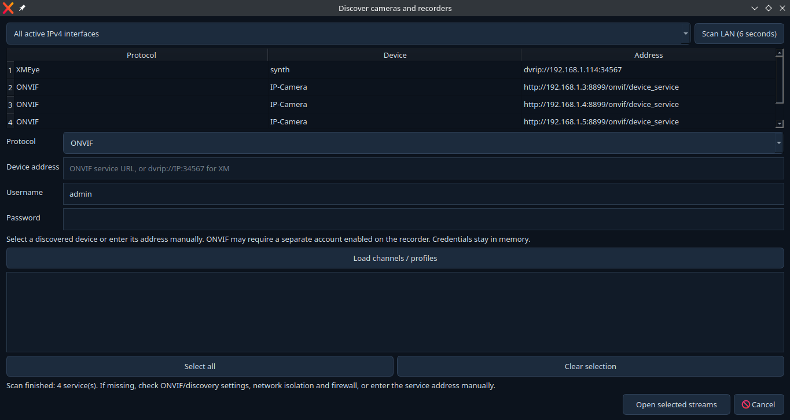

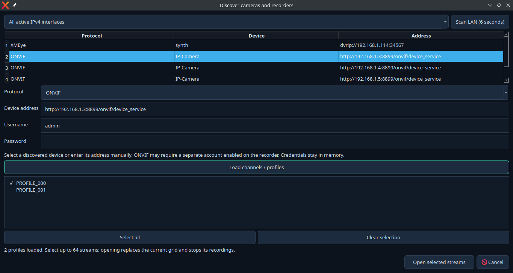

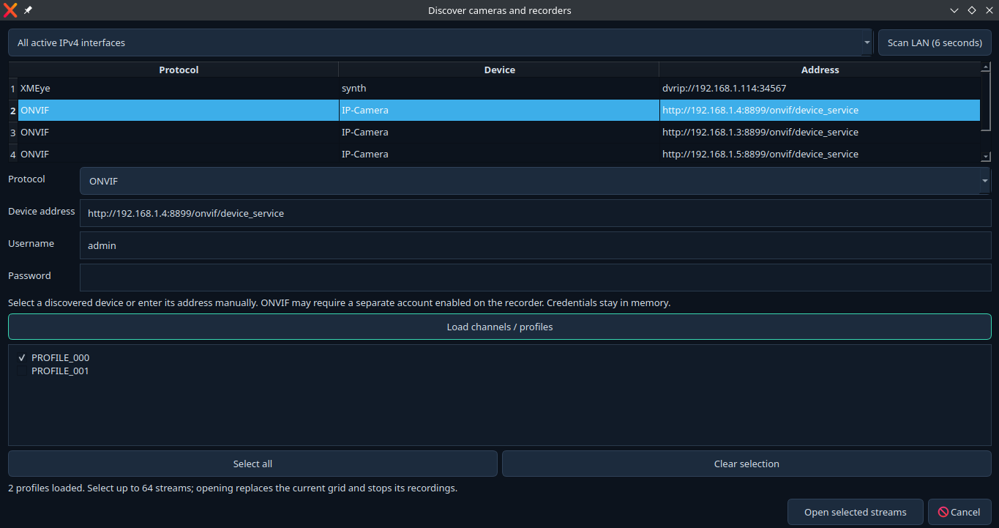

*A completed LAN scan. The list shows one XMEye recorder and several ONVIF cameras. After **Load channels / profiles**, the profile list shows what each camera offers, and up to 64 streams can be opened at once.*

OpenWatch uses:

- ONVIF WS-Discovery;
- Device services;
- Media;
- Media2;
- RTSP stream URI resolution.

Some inexpensive cameras appear in discovery but still fail to load profiles or open a stream through ONVIF.

If this happens, add the camera manually with its RTSP URL instead. See [Manually adding an RTSP stream](#manually-adding-an-rtsp-stream).

Discovery is IPv4-oriented and generally does not cross routed networks/VLANs unless multicast/broadcast forwarding is specifically configured.

---

# Manually adding an RTSP stream

A manually entered RTSP stream may look like:

```text
rtsp://192.168.1.20:554/stream1
```

Use the actual RTSP URL provided by the camera or recorder firmware.

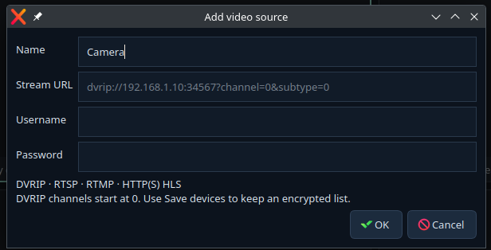

*The **Add video source** dialog accepts DVRIP, RTSP, RTMP and HTTP(S) HLS URLs. DVRIP channels start at 0. Use **Save devices** to keep an encrypted list.*

Credentials should preferably be entered in OpenWatch's separate username/password fields rather than embedded directly into the URL.

---

# Workspace controls

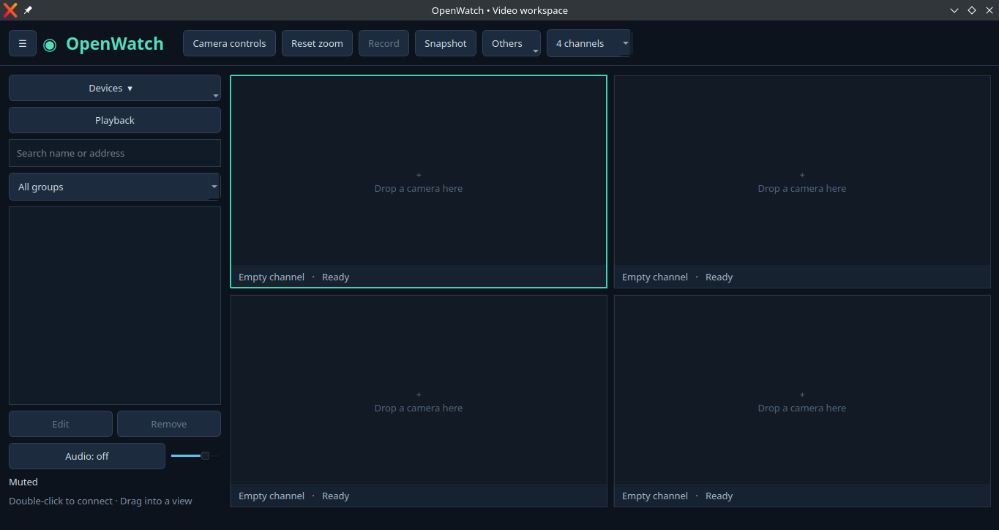

*The empty workspace. Double-click a device to connect, or drag it into a view.*

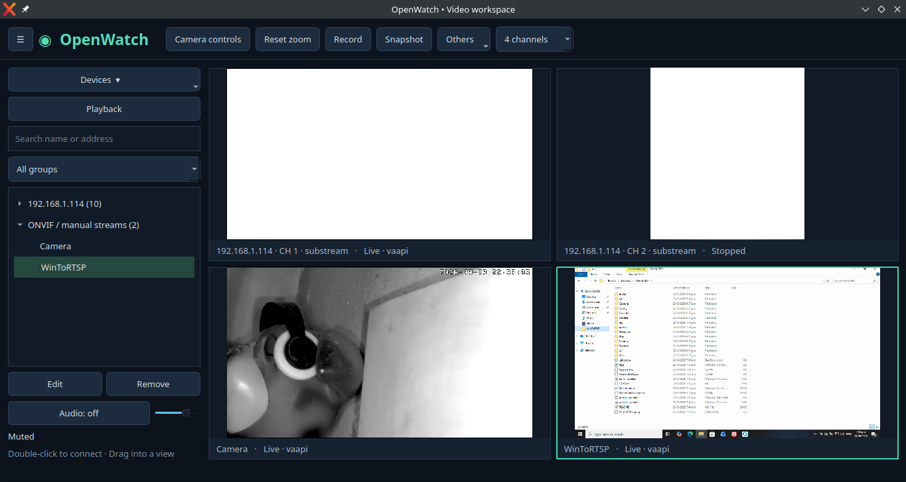

*The same workspace with live streams. The sidebar groups recorder channels and ONVIF/manual streams. Each cell shows its source, stream type and state.*

| Action | Control |
| --- | --- |
| Focus selected video / restore grid | Double-click video |
| Previous / next assigned channel | Left / Right |
| Digital zoom | Mouse wheel |
| Reset digital zoom | **Reset zoom** |
| Workspace fullscreen | F11 |
| Leave fullscreen/focused view | Esc |
| Physical pan/tilt | Alt + Arrow keys |
| Optical zoom | Alt + Page Up / Page Down |
| PTZ Stop | Alt + End |

Digital zoom only changes the local display.

It does not move the physical camera.

---

# Camera controls / PTZ

Select a video cell and open **Camera controls**.

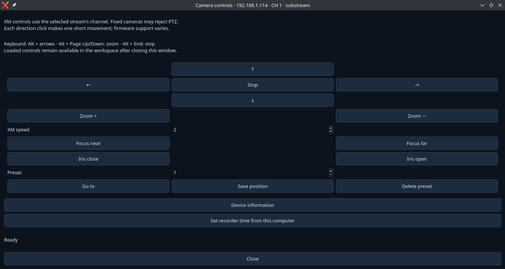

*The Camera controls window for an XM recorder channel. It uses the selected stream's channel. Fixed cameras may reject PTZ commands.*

## XMEye/XM controls

Depending on firmware/device capabilities, OpenWatch can issue commands for:

- pan;
- tilt;
- zoom;
- presets;
- focus;
- iris;
- recorder/device information.

Movement uses short command pulses followed by Stop.

Firmware can reject unsupported commands.

## ONVIF controls

For ONVIF:

1. Open **Camera controls**.
2. Confirm the ONVIF service URL.
3. Load the camera's profiles/configuration.
4. Select the intended profile.
5. Use PTZ or presets when advertised.

Some incomplete ONVIF implementations may work better with **Compatibility mode**.

OpenWatch does not claim ONVIF Profile S/T certification.

## Recorder clock

**Set recorder time** changes the time of the recorder itself.

It is intentionally an explicit action.

Incorrect recorder time or timezone configuration can affect:

- recording timestamps;
- recording searches;
- playback time;
- event timestamps.

---

# Live audio

Enable audio for the selected RTSP stream using the audio control in the main workspace.

OpenWatch decodes supported audio through FFmpeg and outputs it through SDL2.

Current limitations:

- audio initially starts muted;
- direct DVRIP audio is not implemented;
- microphone capture is not implemented;
- two-way audio is not implemented;
- local OpenWatch recordings are video-only.

If you require audio from an NVR channel, use the NVR's RTSP stream when available.

---

# Snapshots and local recording

## Snapshot

**Snapshot** saves the currently displayed frame as a PNG.

## Recording

Select a playing channel and click **Record**.

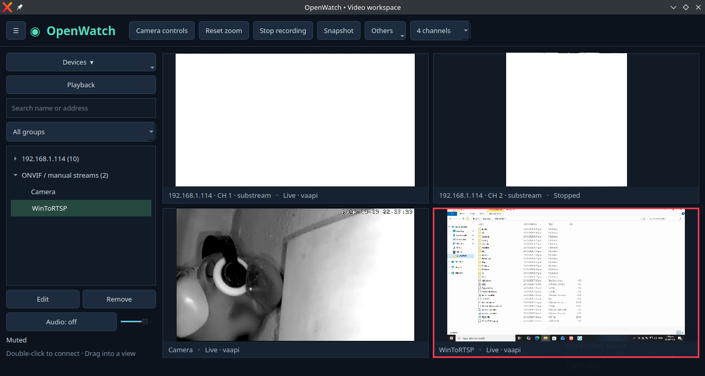

*While a cell is recording, it shows a red border and the **Record** button changes to **Stop recording**. A snapshot confirmation can appear in the same cell.*

OpenWatch starts writing when it reaches a usable video keyframe.

The recording is remuxed into MKV without re-encoding where possible.

Current recordings contain:

> **video only**

When recording is stopped, the current UI can defer the final save destination.

Interrupted network recordings are kept as separate reconnect segments rather than joining discontinuous data into one potentially corrupted MKV.

If a connection is lost:

```text
recording.mkv
recording-reconnect-....mkv
```

may represent separate recording sections.

Pending/unsaved recordings use local storage until saved or removed, so monitor disk space.

OpenWatch currently has no:

- scheduled recorder;
- motion-triggered recorder;
- event recording;
- storage retention engine;
- automatic clip expiration.

It should not be treated as the only recorder in a security-critical installation.

---

# Encrypted device lists

**Save devices** creates an `.owv` file containing saved device information.

Current encryption uses:

- AES-256-GCM;
- PBKDF2-HMAC-SHA256;
- random salt;
- random nonce;
- authenticated metadata.

The passphrase is **not stored by OpenWatch**.

If you lose the passphrase, OpenWatch cannot recover it.

Loading a device file replaces the current device list and does not automatically reconnect every entry.

Save again after changing entries if you want the updated list preserved.

Encryption of the `.owv` file does **not** encrypt normal DVRIP network traffic.

---

# Network recorder playback

Open:

**Playback → Network playback**

OpenWatch can play recorder footage through:

- local DVRIP;
- routed VPN DVRIP;
- XMEye CloudID relay.

Select:

1. connection type;
2. recorder;
3. camera;
4. date;
5. start time;
6. playback duration.

Then choose the requested time.

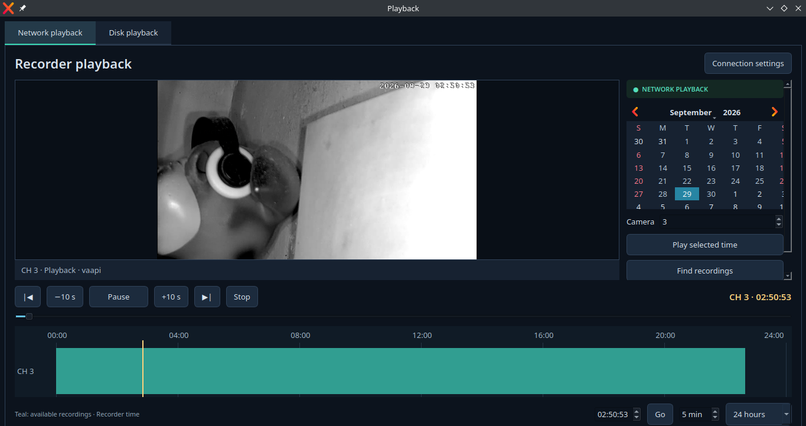

*Network playback for CH3. The calendar, camera number, **Play selected time** and **Find recordings** sit on the right. The teal timeline shows recording ranges reported by the recorder.*

## Direct ByTime playback

OpenWatch can directly request a recorder time without requiring a successful recording-file search first.

This is important because some XMEye firmware can play footage successfully while returning incomplete or empty file-query results.

## Playback channel routing

Official VMS playback capture research showed that playback command `1420` includes a zero-based playback-camera value in the DVRIP header.

Observed values included:

```text
0 = CH1
1 = CH2
2 = CH3
```

This was important to correcting earlier behavior where requesting another channel could still result in CH1 playback.

The current implementation carries the requested channel for playback start/stop while preserving the behavior observed for Claim and file-query operations.

The physical N1009KL test configuration contains three recorded ONVIF cameras, making CH1/CH2/CH3 playback a useful regression test.

---

# Find recordings / timeline coverage

From Network playback, click:

**Find recordings**

OpenWatch sends recorder file-query requests and displays returned ranges on the timeline.

Teal/highlighted sections represent:

> recording intervals **reported by the recorder**

They are not a direct scan of the physical NVR disk.

XMEye firmware can behave inconsistently with recording queries.

OpenWatch includes compatibility behavior for:

- normal queries;
- reduced/minimal queries;
- empty `Ret 119` responses in the file-query context;
- narrower time windows;
- duplicate result removal;
- overlapping results.

Therefore:

> **An empty timeline does not prove there is no footage on disk.**

Manual time playback can still be attempted.

Changing:

- camera;
- date;
- recorder;
- connection method

clears stale search ranges.

---

# Network playback controls

Current production network playback runs at:

```text
1×
```

Earlier development builds experimented with:

```text
0.25×
0.5×
1×
2×
4×
8×
```

but accelerated remote playback was not reliable enough on the physical recorder for the current production UI.

Common navigation includes:

| Action | Control |
| --- | --- |
| Seek backward | Left |
| Seek forward | Right |
| Larger seek | Shift + Left / Right |
| Timeline seek | Click/drag timeline |
| Direct time | **Go** time field |

Seeking generally reopens playback around the requested recorder time.

Recorder firmware may return a nearby keyframe instead of the exact requested frame.

---

# WFS recorder-disk playback

OpenWatch includes an experimental **read-only WFS recorder-disk reader**.

This is separate from network recorder playback.

```text
DVRIP network playback
        !=
WFS physical-disk playback
```

The WFS implementation was developed from read-only investigation of the project's recorder disk.

Observed test disk information included:

```text
WFS0.4
XM signature
512-byte blocks
2 MiB recording fragments
```

The analyzed index contained recording chains associated with three observed camera codes, provisionally corresponding to the three configured cameras.

Recovered sample media included decodable:

- H.264;
- H.265/HEVC.

The reader remains experimental and device-family specific.

---

# Reading an NVR recorder disk on Linux

## Important safety warning

Treat the recorder disk as **read-only**.

Do **not**:

- format it;
- initialize it;
- run filesystem repair utilities on it;
- run `fsck`;
- create a partition table;
- accept desktop prompts to “repair” the disk;
- mount it read/write;
- modify recorder metadata.

WFS is not a normal Linux filesystem.

OpenWatch accesses supported data structures directly.

## 1. Connect the recorder disk

Connect the NVR HDD using:

- SATA;
- USB-to-SATA adapter;
- drive dock.

Linux may detect it as something such as:

```text
/dev/sdb
```

The actual name can differ.

## 2. Identify the correct disk

Use:

```bash
lsblk -o NAME,SIZE,MODEL,SERIAL,FSTYPE,MOUNTPOINTS
```

or:

```bash
sudo fdisk -l
```

You can also check recent kernel messages:

```bash
dmesg | tail -n 50
```

or on systems restricting normal `dmesg` access:

```bash
sudo dmesg | tail -n 50
```

**Verify the model and size carefully before doing anything with a raw device.**

Example:

```text
sdb   931.5G   HGST HTS541010A9E680
```

Do not assume `/dev/sdb` from this README matches your system.

## 3. Ensure nothing is mounted

Check:

```bash
lsblk -o NAME,SIZE,FSTYPE,MOUNTPOINTS
```

If the desktop automatically mounted something from the disk, unmount the relevant partition:

```bash
sudo umount /dev/sdX1
```

Replace `/dev/sdX1` with the actual detected partition.

Do not create a new filesystem or partition if Linux says it does not recognize the disk.

## 4. Give your normal account temporary read access

OpenWatch deliberately opens recorder media **read-only** and recommends not running the whole GUI as root.

One temporary method is:

```bash
sudo setfacl -m u:$USER:r /dev/sdX
```

For example:

```bash
sudo setfacl -m u:$USER:r /dev/sdb
```

Verify:

```bash
getfacl /dev/sdb
```

Then run OpenWatch normally as your user.

Device permissions may reset when the drive is disconnected/reconnected.

Another option is to create a suitable local udev rule, but that should only be done by users familiar with Linux device permissions.

## 5. Open the physical disk in OpenWatch

Open:

**Playback → Disk playback**

Then click:

**Open disk / image**

Enter the raw device path, for example:

```text
/dev/sdb
```

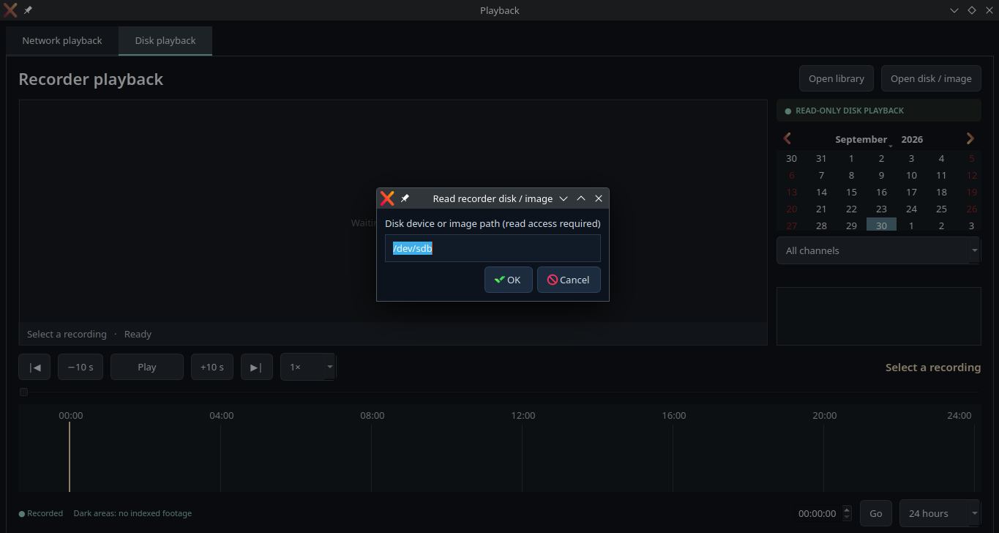

*Enter the raw device path or the image file path. Read access is required.*

OpenWatch opens the disk using read-only file access.

It reads:

- the WFS header;
- candidate filesystem geometry;
- the recording index;
- referenced recording fragments.

It does not intentionally write to the recorder disk.

## 6. Select footage

After index loading:

1. select a highlighted date;
2. select the camera/channel;
3. choose a recording;
4. click or drag within a recorded timeline section.

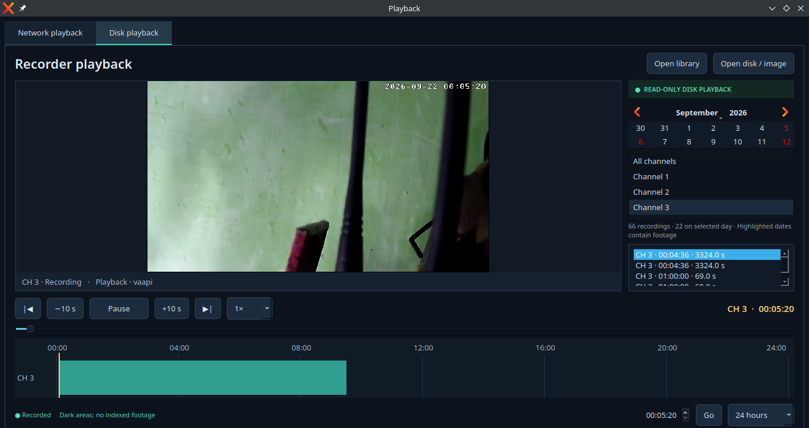

*Read-only disk playback. Use the channel selector and the recording list to choose footage. Highlighted dates contain footage.*

Disk playback supports local playback rates including:

```text
0.25×
0.5×
1×
2×
4×
8×
```

Unlike network speed, these are local playback controls.

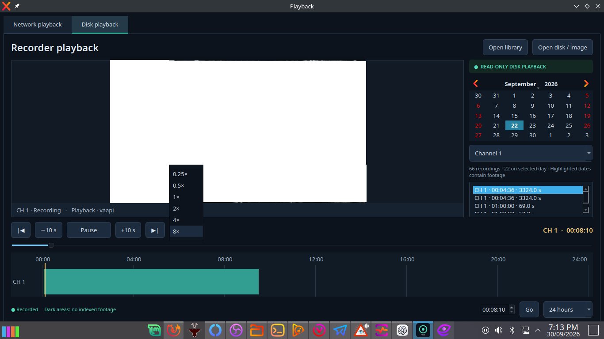

*The playback speed menu in Disk playback.*

---

# Creating a read-only image of the recorder disk on Linux

For investigation and preservation, working from a disk image is safer than repeatedly accessing the original drive.

You need another disk with enough free space for the entire NVR disk.

For a healthy source disk, a simple read-only copy can be made with:

```bash
sudo dd if=/dev/sdX of=/path/to/nvr-disk.img bs=4M status=progress conv=sync,noerror
```

Example:

```bash
sudo dd if=/dev/sdb of=/mnt/storage/nvr-disk.img bs=4M status=progress conv=sync,noerror
```

**Double-check `if=` and `of=` before running `dd`. Reversing them can destroy the recorder disk.**

For questionable/failing disks, `ddrescue` is generally a better imaging tool because it tracks errors and allows retries.

Example:

```bash
sudo apt install gddrescue
```

Then:

```bash
sudo ddrescue -f -n /dev/sdX /mnt/storage/nvr-disk.img /mnt/storage/nvr-disk.map
```

A later retry pass can be performed according to GNU ddrescue documentation.

Once created, OpenWatch can use the regular image file:

```text
/path/to/nvr-disk.img
```

through:

**Playback → Disk playback → Open disk / image**

A regular image file does not require raw-device permissions once your account can read the file.

---

# Inspecting a WFS disk without opening full playback

The repository includes investigation tools under:

```text
tools/
```

## Read the first 64 KiB / inspect header

Example:

```bash
sudo python3 tools/inspect_wfs.py /dev/sdX
```

Use the script's `--help` output for its current options:

```bash
python3 tools/inspect_wfs.py --help
```

`inspect_wfs.py` is designed as a bounded metadata probe.

It opens the source read-only.

It is **not** a filesystem repair tool.

## Collect investigation samples

The repository also contains:

```text
tools/collect_wfs_samples.py
```

Check usage first:

```bash
python3 tools/collect_wfs_samples.py --help
```

The collector was designed to create bounded private samples rather than copy the complete disk.

Samples can contain:

- recorder metadata;
- timestamps;
- camera information;
- video data.

Do not publish raw samples without reviewing them.

## Analyze copied index data

The project also includes:

```text
tools/analyze_wfs_index.py
```

Use:

```bash
python3 tools/analyze_wfs_index.py --help
```

for the currently supported arguments.

---

# Recorder-disk access on Windows

## Disk-image files

The safest currently documented Windows path is:

1. create a raw image of the recorder HDD using a trusted disk-imaging tool;
2. store the image on an NTFS/exFAT/etc. disk with enough free space;
3. open the `.img`/raw file from OpenWatch's **Disk playback → Open disk / image** control.

Regular image files use normal file reads and do not depend on Linux block-device APIs.

## Direct physical disk access

Windows exposes raw physical disks with names similar to:

```text
\\.\PhysicalDrive0
\\.\PhysicalDrive1
```

However, **direct Windows physical-drive WFS playback is not currently considered validated by OpenWatch**.

The current WFS implementation contains Linux-specific block-device size detection using `BLKGETSIZE64`. On non-Linux systems, it relies on normal file-size behavior, which is appropriate for regular image files but may not behave correctly for a Windows physical-device handle.

Therefore, do **not** currently document:

```text
\\.\PhysicalDriveN
```

as a guaranteed working feature.

For Windows users, a raw disk image is the preferred method until direct Windows block-device enumeration and size detection are implemented and tested.

Also avoid accepting Windows prompts to initialize or format an unknown recorder disk.

If Disk Management says the disk must be initialized:

> **Cancel.**

Initializing it can overwrite metadata needed by the recorder.

---

# Opening a prepared WFS library

OpenWatch also supports a prepared experimental recording library.

From:

**Playback → Disk playback**

click:

**Open library**

and select:

```text
library.json
```

The prepared library references local MKV clips and metadata produced by the WFS research tools.

The library loader validates paths and keeps referenced footage within the library directory.

This mode is useful for testing or viewing copied/reconstructed recordings without keeping the physical recorder disk connected.

---

# WFS safety and limitations

Current WFS support is deliberately read-only.

OpenWatch does **not**:

- modify the recorder filesystem;
- repair WFS;
- rewrite indexes;
- delete recordings;
- initialize disks;
- recover arbitrary damaged disks;
- decrypt unknown encrypted recordings;
- guarantee compatibility with every WFS revision.

The implementation currently expects the geometry observed during the project research, including:

```text
WFS0.4
512-byte block size
2 MiB fragment size
```

Unsupported geometry is rejected rather than guessed.

This is intentional.

---

# Building OpenWatch from source

The project root is the directory containing:

```text
README.md
CMakeLists.txt
src/
scripts/
tests/
docs/
```

The provided build script supports:

- Linux;
- Windows through **MSYS2 UCRT64**.

It is **not a cross-compiler**.

Running it on Linux creates Linux binaries.

Running it in MSYS2 UCRT64 creates Windows binaries.

---

# Build dependencies

OpenWatch currently requires:

- C++17 compiler
- CMake **3.21+**
- Qt **6.2+**
  - Widgets
  - Network
  - Test
  - Xml
- pkg-config
- OpenSSL
- SDL2
- FFmpeg development libraries:
  - `libavformat`
  - `libavcodec`
  - `libavutil`
  - `libswscale`
  - `libswresample`

Tests additionally use:

- Python 3
- `ffmpeg`
- `ffprobe`
- FFmpeg builds containing `libx264` and `libx265` for the Linux integration fixtures

---

# Linux build

The main development environment has been:

```text
Linux Mint 22.2
Ubuntu 24.04 base
GCC 13.3
Qt 6.4.2
FFmpeg 6.1.1
```

Other compatible distributions may work but are not necessarily field-tested.

## Ubuntu / Debian / Linux Mint dependencies

Install:

```bash
sudo apt update
```

Then:

```bash
sudo apt install \
  build-essential \
  cmake \
  pkg-config \
  qt6-base-dev \
  libssl-dev \
  libsdl2-dev \
  libavformat-dev \
  libavcodec-dev \
  libavutil-dev \
  libswscale-dev \
  libswresample-dev \
  ffmpeg \
  python3
```

## Clone the repository

```bash
git clone https://github.com/proot411/OpenWatch.git
cd OpenWatch
```

## Standard Release build

```bash
bash scripts/build.sh
```

The default output is:

```text
build/linux/openwatch
```

Run it directly:

```bash
./build/linux/openwatch
```

No installation is required.

---

# Build and run tests

Use:

```bash
bash scripts/build.sh --test
```

The script:

1. configures the Release build;
2. builds OpenWatch;
3. builds the enabled test targets;
4. runs CTest;
5. performs an offscreen application startup smoke test.

For Linux integration tests, make sure FFmpeg contains:

```text
libx264
libx265
```

Check:

```bash
ffmpeg -hide_banner -encoders | grep -E 'libx264|libx265'
```

---

# Change compilation parallelism

The script defaults to two build jobs to keep memory usage reasonable.

Use:

```bash
bash scripts/build.sh --jobs 4
```

or:

```bash
bash scripts/build.sh --test --jobs 4
```

Choose a number appropriate for your CPU and RAM.

---

# Custom build directory

Example:

```bash
bash scripts/build.sh --build-dir "$HOME/builds/openwatch"
```

Or:

```bash
bash scripts/build.sh \
  --build-dir "/path/with spaces/OpenWatch build" \
  --jobs 2 \
  --test
```

Do not use the source root itself as the CMake build directory.

---

# Show build-script options

```bash
bash scripts/build.sh --help
```

Current options include:

```text
--build-dir PATH
--jobs N
--test
--package TGZ|DEB
--help
```

---

# Build a Debian package

After dependencies are installed:

```bash
bash scripts/build.sh --test --package DEB
```

Generated packages are placed under:

```text
build/linux/packages/
```

The DEB uses system dependencies.

It is **not** a fully self-contained AppImage.

You can still run:

```bash
./build/linux/openwatch
```

without installing the package.

---

# Build a TGZ package

Use:

```bash
bash scripts/build.sh --package TGZ
```

or with tests:

```bash
bash scripts/build.sh --test --package TGZ
```

Packages appear under:

```text
build/linux/packages/
```

---

# Manual CMake build

The provided build script is recommended, but a normal CMake build is also possible.

Example:

```bash
cmake -S . -B build/manual \
  -DCMAKE_BUILD_TYPE=Release \
  -DBUILD_TESTING=OFF
```

Then:

```bash
cmake --build build/manual --parallel 2
```

Run:

```bash
./build/manual/openwatch
```

With tests enabled:

```bash
cmake -S . -B build/test \
  -DCMAKE_BUILD_TYPE=Release \
  -DBUILD_TESTING=ON
```

Then:

```bash
cmake --build build/test --parallel 2
ctest --test-dir build/test --output-on-failure
```

---

# Fedora / other Linux distributions

Install equivalent packages providing:

- GCC/G++;
- CMake;
- pkgconf/pkg-config;
- Qt 6 base development files;
- OpenSSL development files;
- SDL2 development files;
- FFmpeg development libraries.

Then run:

```bash
bash scripts/build.sh
```

Package names and FFmpeg codec availability vary by distribution/repository.

This path has received less validation than Linux Mint/Ubuntu.

---

# Windows 10/11 build

Windows builds use:

> **MSYS2 UCRT64**

Do not use:

- Git Bash;
- plain MSYS shell;
- MINGW64 shell;
- WSL

for the supported build-script path.

## 1. Install MSYS2

Install MSYS2 from the official project.

Update MSYS2 according to its normal installation instructions.

Then launch:

```text
MSYS2 UCRT64
```

Check:

```bash
echo $MSYSTEM
```

It should return:

```text
UCRT64
```

## 2. Install dependencies

Inside the **UCRT64** shell:

```bash
pacman -S --needed \
  mingw-w64-ucrt-x86_64-gcc \
  mingw-w64-ucrt-x86_64-cmake \
  mingw-w64-ucrt-x86_64-ninja \
  mingw-w64-ucrt-x86_64-pkgconf \
  mingw-w64-ucrt-x86_64-qt6-base \
  mingw-w64-ucrt-x86_64-ffmpeg \
  mingw-w64-ucrt-x86_64-openssl \
  mingw-w64-ucrt-x86_64-SDL2
```

## 3. Clone OpenWatch

If Git is installed in your environment:

```bash
git clone https://github.com/proot411/OpenWatch.git
cd OpenWatch
```

Or download/extract the source tree and navigate to it in the UCRT64 terminal.

## 4. Build

```bash
bash scripts/build.sh
```

Output:

```text
build/windows/openwatch.exe
```

Run it inside UCRT64:

```bash
./build/windows/openwatch.exe
```

## Build Windows tests

```bash
bash scripts/build.sh --test
```

The Windows test selection currently focuses on native Qt suites and the application smoke check.

Some Python/network/media integration fixtures are validated primarily on Linux and are not claimed equivalent on Windows.

---

# Windows runtime dependencies

The raw Windows executable produced in MSYS2 is **not automatically a standalone portable EXE**.

When running inside the UCRT64 shell, required DLLs are available through:

```text
/ucrt64/bin
```

For distribution outside MSYS2, dependencies must be collected.

These can include:

- Qt 6 DLLs;
- Qt platform plugins;
- FFmpeg DLLs;
- SDL2;
- OpenSSL;
- GCC/UCRT runtime dependencies;
- transitive dependencies.

Qt's:

```text
windeployqt
```

can deploy Qt components, but it does not necessarily collect all FFmpeg, SDL2, OpenSSL and related dependencies.

The repository CI contains experimental Windows packaging work, but a successful CI build should not automatically be treated as broad Windows runtime validation.

---

# Hardware video decoding

OpenWatch attempts FFmpeg hardware-device initialization where supported.

Potential backends depend on platform/build and may include technologies such as:

- VAAPI;
- DXVA2;
- D3D11VA;
- CUDA/NVDEC;
- Intel QSV.

If hardware initialization fails, OpenWatch falls back to software decoding.

Current rendering still transfers frames into host memory for Qt display.

Therefore:

> hardware decode support does not currently mean zero-copy rendering.

---

# Reconnect behavior

Network live streams retry transient failures using an increasing delay:

```text
1 s
2 s
4 s
8 s
16 s
30 s
```

The delay then remains capped around 30 seconds for continued failures.

A stable connection resets the backoff.

Authentication rejection, unsupported media/protocol errors, and similar terminal conditions are not endlessly retried.

Disconnecting a stream manually stops its reconnect attempts.

---

# Recorder login lockout / code 205

Some XMEye firmware uses response code `205` for a login/security lockout condition.

If correct credentials suddenly stop working after multiple attempts:

1. stop repeated login attempts;
2. close other tools using the same account where appropriate;
3. allow the recorder's configured lockout interval to expire;
4. inspect the recorder's security/login logs through an already authorized interface if available.

OpenWatch does not attempt to bypass recorder lockout protections.

Do not assume a universal lockout duration; firmware behavior varies.

---

# Project architecture

At a simplified level:

```text
                                OpenWatch
                                   │
                    ┌──────────────┴──────────────┐
                    │                             │
                  Qt UI                      Device registry
                    │                             │
                    │                       encrypted .owv
                    │
        ┌───────────┼─────────────┬─────────────────────────┐
        │           │             │                         │
        ▼           ▼             ▼                         ▼
      DVRIP       ONVIF         RTSP                    XMEye Cloud
        │           │             │                         │
        │           │             │                  bootstrap/directory
        │           │             │                         │
        │           │             │                    rendezvous
        │           │             │                         │
        │           │             │                     relay/XMIP
        │           │             │                         │
        └───────────┴─────────────┴─────────────────────────┘
                                │
                                ▼
                        FFmpeg media path
                                │
                 ┌──────────────┼───────────────┐
                 │              │               │
                 ▼              ▼               ▼
               Video          Audio         MKV recorder
                 │              │
                 ▼              ▼
                Qt             SDL2
```

Recorder playback adds separate control and media paths.

WFS disk playback is a separate local read-only backend.

---

# Repository layout

```text
src/
    Main application, UI, DVRIP, CloudID/XMIP,
    discovery, controls, video/audio, playback,
    WFS access, registry and encrypted vault.

tests/
    Protocol tests, simulated devices,
    media integration tests and regressions.

tools/
    Optional recorder, CloudID and WFS
    investigation/diagnostic utilities.

scripts/
    Native Linux / Windows build entry point.

docs/
    Architecture, protocol notes, validation,
    research and release documentation.

images/
    Documentation screenshots.

.github/
    CI workflow.
```

Private:

- packet captures;
- vendor DLLs;
- serial numbers;
- credentials;
- extracted recorder video;
- WFS samples

should remain outside Git.

---

# Validation philosophy

OpenWatch uses several levels of evidence.

## Synthetic validation

Simulated protocol peers and generated video exercise:

- DVRIP framing;
- monitor sessions;
- reconnect;
- RTSP;
- ONVIF;
- CloudID/XMIP;
- playback;
- encrypted device files;
- media decoding;
- WFS structures.

Useful for regression testing, but not proof of firmware compatibility.

## Capture-backed research

Private official-client packet captures have been used to understand:

- CloudID/XMIP;
- relay association;
- DVRIP-over-cloud;
- playback;
- channel selection.

Captures are not included in the public repository.

## Static interoperability research

Owner-supplied vendor VMS components were inspected read-only to understand relevant protocol behavior.

OpenWatch does not link or redistribute those vendor DLLs.

## Physical-recorder validation

The strongest current real-world evidence comes from the project's:

> **Xmeye N1009KL 10 Channel NVR with 3 configured ONVIF cameras**

This environment has been used for:

- live viewing;
- CloudID relay testing;
- recording;
- playback;
- multi-channel playback investigation;
- recorder-file searches;
- disk/WFS investigation.

Results should still not be generalized to all Xiongmai firmware.

See [docs/validation.md](docs/validation.md).

---

# Security considerations

## Local DVRIP

Legacy DVRIP/Sofia authentication is not a modern encrypted transport.

Use:

- a trusted LAN;
- a VPN;

when possible.

## CloudID

Cloud login/control uses behavior observed in the vendor protocol, including RSA/AES negotiation.

However:

- it is not TLS;
- the recorder's public key is not authenticated using a standard certificate chain;
- XMIP's sparse XOR layer is not modern cryptographic encryption.

Do not describe the CloudID transport as equivalent to end-to-end certificate-authenticated TLS.

## Local credential storage

The `.owv` device list is encrypted independently of network transport.

The implementation has not undergone an independent professional security audit.

---

# Known limitations

OpenWatch does not currently provide:

- direct CloudID NAT hole punching;
- Android XMEye account/RPS login flow;
- synchronized multi-camera recorder playback;
- direct DVRIP audio;
- microphone/two-way audio;
- audio inside local MKV recordings;
- scheduled recording;
- motion/alarm recording automation;
- storage retention policies;
- event notification system;
- role-based user accounts;
- comprehensive NVR configuration;
- firmware updates;
- recorder account management;
- network configuration management;
- PTZ tours;
- complete ONVIF Profile certification;
- general WFS filesystem repair;
- automatic updates;
- guaranteed Windows portable packaging;
- guaranteed operation with all Xiongmai firmware.

---

# Troubleshooting

## Recorder connects but some channels fail

The NVR can report channels that are not currently populated.

Try:

- checking whether that channel contains a configured camera;
- switching Main/Substream;
- testing the same channel through the recorder's official UI.

## Substream fails

Try the main stream.

Some cameras/NVR configurations do not expose every expected subtype.

## ONVIF camera is discovered but stream will not open

Check:

- camera username/password;
- ONVIF account permissions;
- correct ONVIF service port;
- RTSP permissions;
- camera profile selection.

Some cameras require ONVIF to be enabled explicitly.

## Cloud connection fails

Cloud access depends on:

- XMEye infrastructure;
- region/service endpoints;
- UDP connectivity;
- recorder cloud status;
- recorder credentials;
- firmware compatibility.

Local DVRIP success does not guarantee CloudID success.

## Find recordings shows nothing

Try direct playback at a time known to contain footage.

An empty OPFileQuery result is not proof that the disk is empty.

## Recorder disk will not open

Verify:

1. it is actually a compatible WFS disk;
2. you selected the complete raw disk rather than the wrong partition;
3. your normal user has read permission;
4. the disk is not disconnected;
5. the image is complete and not truncated.

Do not repair or format the disk to make Linux/Windows recognize it.

---

# Version 0.14.0 notes

OpenWatch 0.14 promotes the current:

- local recorder live view;
- XMEye CloudID relay;
- encrypted cloud DVRIP authentication;
- recorder network playback;
- timeline recording coverage;
- WFS disk playback;
- grouped device sidebar;
- ONVIF controls;
- RTSP audio;
- deferred-save recording workflow

into the production source tree.

Network playback remains at **1×** because accelerated recorder playback proved insufficiently reliable on the physical test recorder.

The production executable is:

```text
openwatch
```

Older experimental/test builds may use different executable/settings names.

See:

[docs/production-0.14.md](docs/production-0.14.md)

for release-specific notes.

---

# Documentation

More detailed information is available in:

| Document | Purpose |
| --- | --- |
| [docs/manual.md](docs/manual.md) | User operation |
| [docs/architecture.md](docs/architecture.md) | Application architecture |
| [docs/protocol.md](docs/protocol.md) | DVRIP/Sofia/ONVIF protocol notes |
| [docs/validation.md](docs/validation.md) | Validation status and history |
| [docs/XMEye-CloudID-P2P.md](docs/XMEye-CloudID-P2P.md) | CloudID/XMIP relay research |
| [docs/XMEye-remote-playback-research.md](docs/XMEye-remote-playback-research.md) | Recorder playback research |
| [docs/xmeye-p2p.md](docs/xmeye-p2p.md) | Historical cloud/P2P investigation |
| [docs/wfs-investigation.md](docs/wfs-investigation.md) | Recorder-disk/WFS research |
| [docs/sources.md](docs/sources.md) | Sources and acknowledgements |
| [AGENTS.md](AGENTS.md) | Architecture/evidence guidance for AI coding agents |

---

# Sources and acknowledgements

The consolidated [source list](docs/sources.md) identifies:

- DVRIP interoperability references;
- ONVIF specifications;
- XMEye public documentation;
- CloudID investigation sources;
- WFS research;
- FFmpeg;
- Qt;
- SDL2;
- OpenSSL;
- build/deployment references.

Upstream projects are used as interoperability references.

Their existence does not mean OpenWatch implements all their capabilities.

No upstream DVRIP implementation is simply vendored into OpenWatch.

Private vendor binaries used during interoperability research are not distributed with the project.

---

# License

Original OpenWatch source is distributed under the [MIT License](LICENSE).

Third-party components retain their own licenses.

The MIT license does not relicense:

- Qt;
- FFmpeg;
- SDL2;
- OpenSSL;
- system libraries.

Review the exact licenses and redistribution requirements of the binaries used in any packaged OpenWatch release.

The development FFmpeg build may include GPL components such as `libx264`/`libx265`; distribution requirements therefore depend on the exact FFmpeg build being shipped.

---

# Project status

OpenWatch should currently be considered:

> **experimental but usable interoperability software**

It has progressed beyond a protocol proof-of-concept and has been tested against a real NVR installation, but it is not intended to replace a vendor NVR in critical deployments without additional testing.

Contributions, protocol observations, and reproducible compatibility reports are useful—especially when they clearly identify:

- recorder model;
- firmware version;
- camera configuration;
- connection method;
- exact operation tested;
- whether the result came from physical hardware, a capture, or a simulation.

Never include public:

- recorder passwords;
- CloudIDs/serial numbers;
- private addresses;
- authentication keys;
- raw private camera footage;
- unsanitized packet captures.
